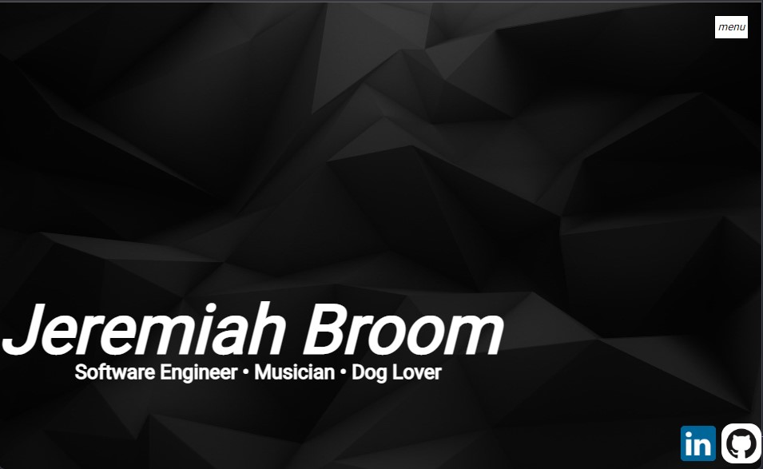

# Portfolio

<h2>Technologies Used</h3>
    <ul>
        <li>HTML</li>
        <li>CSS</li>
        <li>JavaScript</li>
    </ul>

<h2>Installation Instructions</h2>
    
There aren't any specific instructions for installation for this Portfolio as it is a site that can be navigated through. However, there may be updates in the future and this section will be updated accordingly.

<h2>User Stories</h2>

<ul>
<li>As a Hiring Manager or Technical Recruiter, I would use this site to gain insight on Jeremiah as a person, how his work looks and what he likes to do outside of work.</li>
<li>As a potential client, I would use Jeremiah's portfolio to get an idea of the type of work he does and how that would suit my needs.</li>
</ul>

<h2>Wire Frame</h2>

<h2>Unsolved Mysteries</h2>
